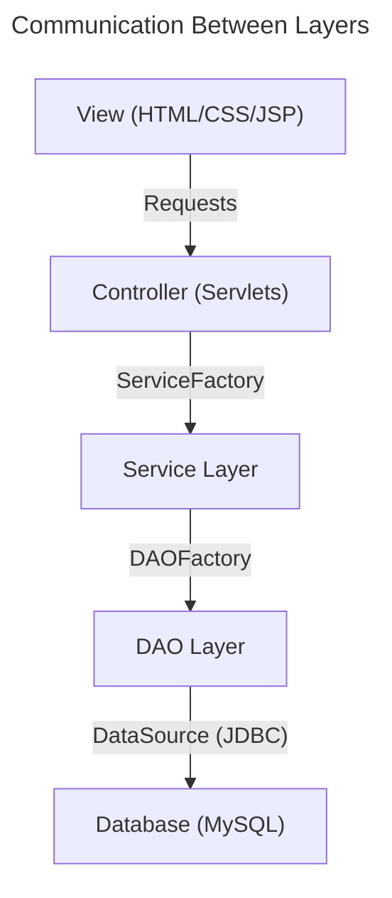

# Welcome to QuickCart

## Tech Stack

- **Backend:**
  - **Java EE:** Enterprise Edition for building robust web applications.
  - **Servlet:** Java API for handling HTTP requests and responses.
  - **Tomcat:** An open-source implementation of the Java Servlet, JavaServer Pages (JSP), and Java Expression Language (EL) technologies.

- **Frontend:**
  - **HTML:** Markup language for creating web pages.
  - **CSS (Bootstrap):** Framework for responsive and modern web design.
  - **JSP (JavaServer Pages):** Technology for creating dynamic web content.

- **Database:**
  - **MySQL:** Open-source relational database management system.

- **Testing:**
  - **JUnit:** Framework for unit testing Java applications.

- **Logging:**
  - **log4j-web:** Library for logging application behavior and errors.
  - **Logfile Location:** [applicationLogs.log](C:\QuickCart\applicationLogs.log)

## Architecture Diagram

The architecture diagram below illustrates the communication between different layers of the QuickCart application:

## Explanation

### 1. **View Layer**
   - **Responsibilities:** Displays the user interface and interacts with the user.
   - **Technologies:** HTML, CSS (Bootstrap), JSP.

### 2. **Controller Layer**
   - **Responsibilities:** Handles incoming HTTP requests, processes user input, and coordinates responses.
   - **Technologies:** Servlets.

### 3. **Service Layer**
   - **Responsibilities:** Contains business logic and interacts with the DAO layer to perform data operations.
   - **Technologies:** implemented using business service classes.

### 4. **DAO Layer**
   - **Responsibilities:** Manages data access operations. Implements data access objects (DAOs) to interact with the database.
   - **Technologies:** JDBC (Java Database Connectivity), DAO interfaces and implementations.

### 5. **Database**
   - **Responsibilities:** Stores application data.
   - **Technologies:** MySQL, relational database management system.

## Logging

- **Log4j Configuration:** The application uses log4j for logging. Logs are written to a file specified in the configuration.
- **Logfile Location:** [applicationLogs.log](C:\QuickCart\applicationLogs.log)
