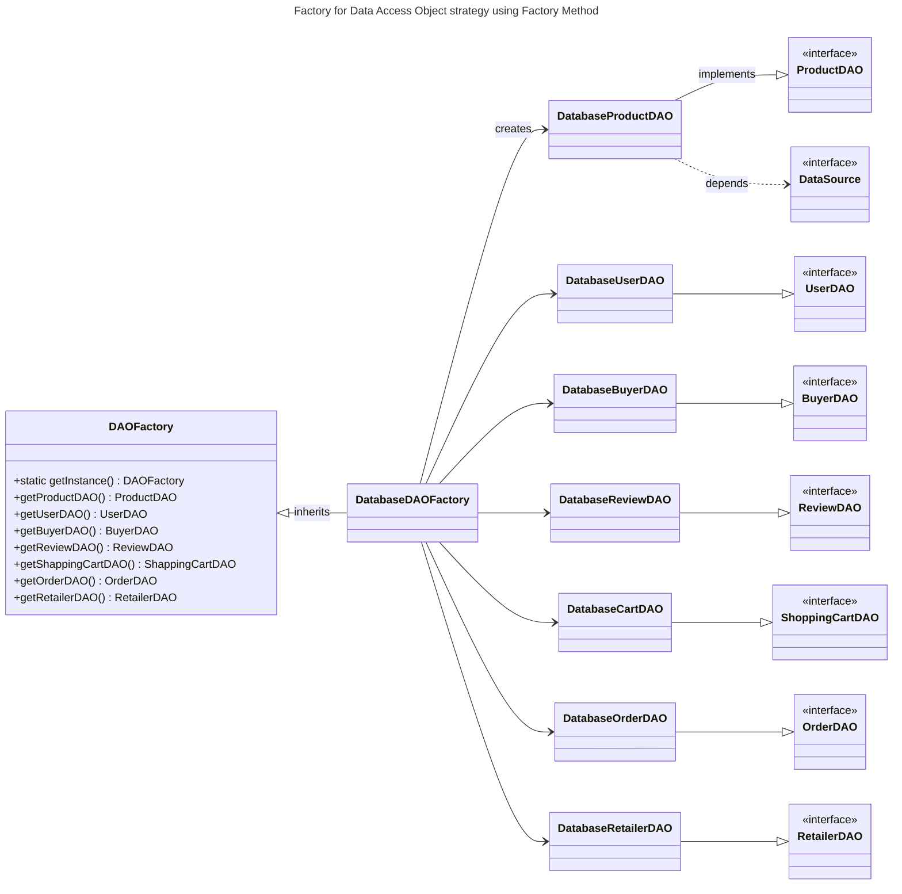

## DAO design pattern

Access to data varies depending on the source of the data. Access to persistent storage, such as to a database, varies greatly depending on the type of storage (relational databases, object-oriented databases, flat files, and so forth) and the vendor implementation.

Use a Data Access Object (**DAO**) to **abstract and encapsulate all access to the data source.** The DAO manages the connection with the data source to obtain and store data.

-----

------

Reference: https://www.oracle.com/java/technologies/dataaccessobject.html
