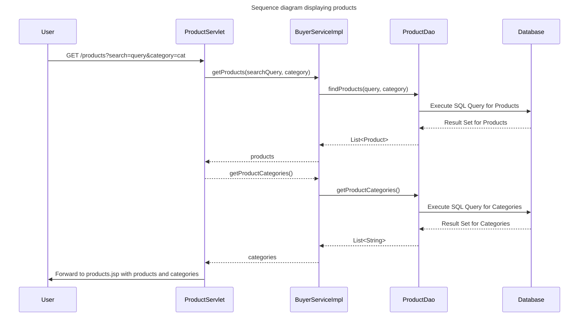

```mermaid
---
title: Sequence diagram displaying products
---

sequenceDiagram
    participant User as User
    participant PS as ProductServlet
    participant BS as BuyerServiceImpl
    participant PD as ProductDao
    participant DB as Database

    User->>PS: GET /products?search=query&category=cat
    PS->>BS: getProducts(searchQuery, category)
    BS->>PD: findProducts(query, category)
    PD->>DB: Execute SQL Query for Products
    DB-->>PD: Result Set for Products
    PD-->>BS: List<Product>
    BS -->> PS: products
    PS -->> BS: getProductCategories()
    BS->>PD: getProductCategories()
    PD->>DB: Execute SQL Query for Categories
    DB-->>PD: Result Set for Categories
    PD-->>BS: List<String>
    BS-->>PS: categories
    PS->>User: Forward to products.jsp with products and categories

```